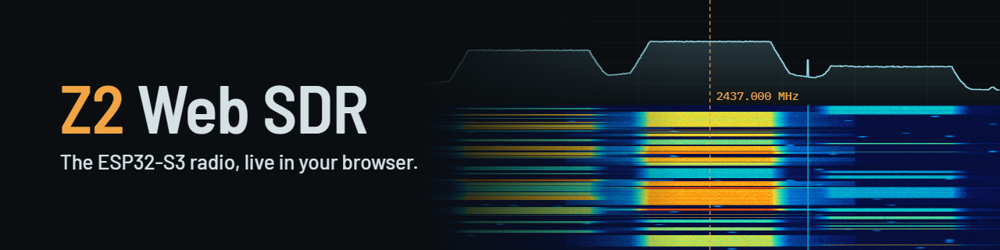
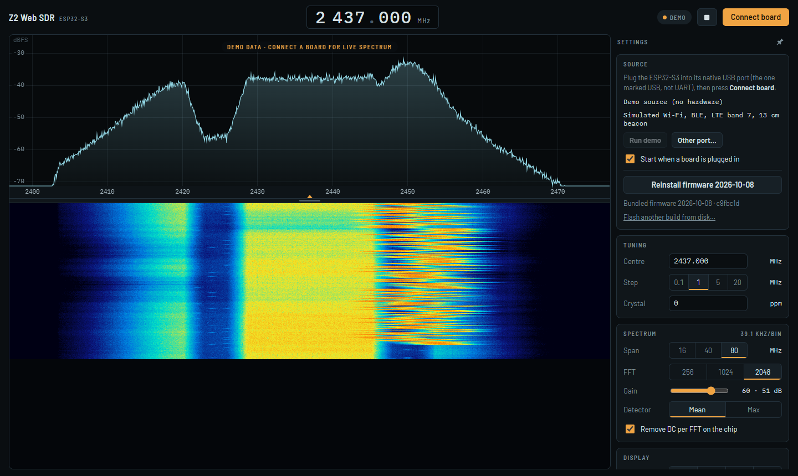

# Z2 Web SDR

**Open it: [z2labs.github.io/z2-web-sdr](https://z2labs.github.io/z2-web-sdr/)** (Chrome or Edge), or download [`index.html`](index.html) and open it from disk.

A browser front end for the ESP32-S3 software-defined radio (ESP-SDR firmware). One HTML file: open it in Chrome or Edge, plug the board in, press **Connect board**. No install, no drivers, no server.

- Live on-chip spectrum of 16, 40 or 80 MHz with 256 to 2048 bins, about 270 spectra per second over the plain USB cable.
- Waterfall with every spectrum as a row, drawn on the GPU (WebGL2, 2D canvas fallback). History stays at its frequency when you pan, zoom or retune.
- Touch-first: drag to tune, pinch or Ctrl + scroll to zoom, tap for a marker, per-digit frequency readout. Works on phones and desktops.
- Firmware install over the same USB cable (the ESP32-S3 ROM bootloader, like esptool). The current ESP-SDR firmware is built into the page.
- Auto range, peak hold, marker to peak, spectrum export to CSV (snapshot, average or max over N spectra, interval log), debug report.
- Starts by itself when a board is plugged in (after the first permission), keeps the screen on.

The ESP32-S3 receives 2204–2804 MHz.



## Use

1. Open `index.html` (from this repository, a release, or the hosted page) in **Chrome or Edge** on Windows, macOS or Linux. Web Serial is not available in Firefox, Safari or on iOS.
2. Connect the ESP32-S3 by its **native USB port** (on a DevKit the connector marked USB, not UART).
3. Press **Connect board** and pick the port. If the board has no ESP-SDR firmware, or an older one, the orange **Install firmware** button installs the bundled build (tap twice; about 15 s).

The page works from a local file (`file://`) or any https address. Settings are kept in the browser.

## Build

`index.html` is generated; edit the files in `src/`.

```
python tools/build.py [fw_dir]   # inline src/flasher.js and embed the firmware bundle
python tools/build.py --check    # CI: index.html must match src/ and fw/
```

`fw/` holds the firmware bundle in the layout SDR++ ESP ships (`flash_args`, `bootloader/`, `partition_table/`, `esp_sdr.bin`, `version.json`). To update the firmware, replace `fw/` with a new bundle and rebuild.

## Tests

The tests run in headless Chromium against an emulated board (`test/mock_board.js`: the ESP-SDR text protocol and SPC1 frames, and the ROM bootloader with the USB Serial/JTAG reset logic).

```
pip install playwright && python -m playwright install chromium
python test/gen.py && node test/run.mjs && node test/md5test.mjs
python test/live.py && python test/flash.py && python test/reflash.py && python test/features.py && python test/wrongport.py && python test/rack.py
```

`tools/render_images.py` renders `docs/banner.png`, `docs/social.png` (the repository's social preview) and `docs/screenshot.png` from `docs/banner.html` and the page, with headless Chrome or Edge.

`tools/capture_spec.py` records a raw SPEC stream from a real board (pyserial), `tools/check_capture.py` walks it the way the page does.

## Related

- Firmware: [zodoczi/esp-sdr](https://github.com/zodoczi/esp-sdr) (fork of [ESPARGOS/esp-sdr](https://github.com/ESPARGOS/esp-sdr)). The firmware binaries in `fw/` and embedded in `index.html` are built from it; its source is available there under GPLv3.
- Desktop and Android app: SDR++ ESP, [z2labs/SDRPlusPlus](https://github.com/z2labs/SDRPlusPlus), with the source module [z2labs/sdrpp-esp-sdr-source](https://github.com/z2labs/sdrpp-esp-sdr-source). The serial protocol client and the flasher in this page are ports of that module.

## License

GPLv3, see `LICENSE`.
